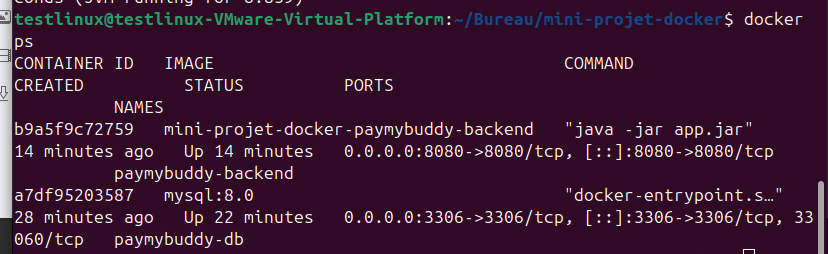
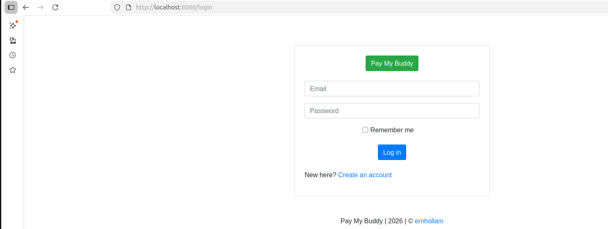
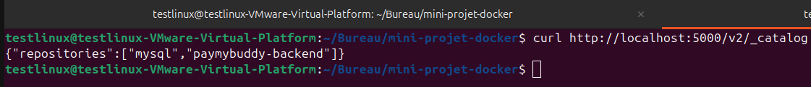
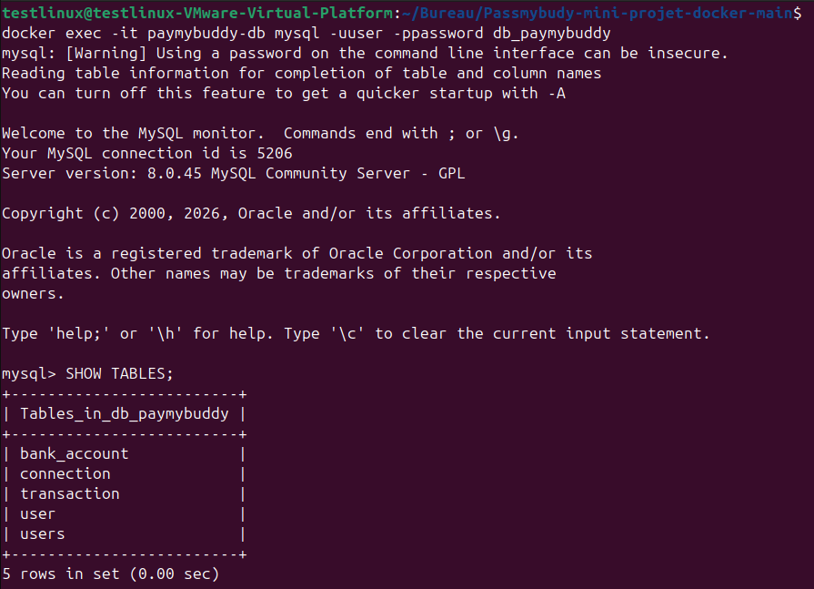

# PayMyBuddy - Dockerized Application

## Description
Application Spring Boot permettant de gérer des transactions entre utilisateurs.

Ce projet est entièrement conteneurisé avec Docker :
- Backend : Spring Boot (Java 17)
- Base de données : MySQL 8
- Registry Docker local

---

## Lancer le projet

### 1. Cloner le repository
```bash
git clone <URL_DU_REPO>
cd mini-projet-docker
```

### 2. Configurer les variables d’environnement
Copier le fichier d’exemple :
```bash
cp .env.example .env
```
Modifier si nécessaire.

### 3. Lancer les conteneurs
```bash
docker compose up --build
```
### 4. Accéder à l'application
Ouvrir un navigateur :
http://localhost:8080

## Configuration de la base de données
-	Host : paymybuddy-db
-	Port : 3306
-	Database : db_paymybuddy
-	Username : user
-	Password : password

## Registry Docker local
### Lancer le registry
```bash
docker run -d -p 5000:5000 --name registry --restart=always registry:2
```
## Tag des images
```bash
docker tag paymybuddy-backend:latest localhost:5000/paymybuddy-backend:latest
docker tag mysql:8.0 localhost:5000/mysql:8.0
```

## Push vers le registry
```bash
docker push localhost:5000/paymybuddy-backend:latest
docker push localhost:5000/mysql:8.0
```

## Vérification
```bash
curl http://localhost:5000/v2/_catalog
```

Résultat attendu :
{"repositories":["paymybuddy-backend","mysql"]}

## Structure du projet
```
mini-projet-docker/
│
├── docker-compose.yml
├── Dockerfile
├── .env
├── .env.example
├── initdb/
│   └── create.sql
├── screenshots/
│   ├── app-login.png
│   ├── docker-up.png
│   ├── mysql-tables.png
│   └── registry.png
└── README.md
```

## Fonctionnement de la base de données
-	La base est créée automatiquement via Docker :
-	MYSQL_DATABASE=db_paymybuddy
-	Les scripts SQL dans initdb/ sont exécutés au premier démarrage

## Vérification des tables
```bash
docker exec -it paymybuddy-db mysql -uuser -ppassword db_paymybuddy
```

Puis :
```bash
SHOW TABLES;
```

## Commandes utiles
### Lancer les conteneurs :
```bash
docker compose up --build
```
### Stopper les conteneurs :
```bash
docker compose down
```
### Reset complet (supprime volumes) :
```bash
docker compose down -v
```

### Voir les conteneurs actifs :
```bash
docker ps
```
### Voir les logs :
```bash
docker logs paymybuddy-backend
docker logs paymybuddy-db
```

## Captures d'écran

### Conteneurs Docker en cours d'exécution


### Interface de l'application (login)


### Registry Docker


### Tables MySQL


## Points clés du projet
-	Utilisation de Docker Compose pour orchestrer plusieurs services
-	Mise en place d’un registry Docker local
-	Gestion des variables d’environnement avec .env
-	Initialisation automatique de la base de données
-	Communication entre conteneurs via réseau Docker

## Auteur
Projet réalisé par Marvin-Git-Project
Dans le cadre d’un bootcamp proposé par Eazytraining

